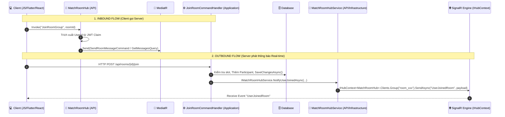

# BẢN THIẾT KẾ & HƯỚNG DẪN CẤU HÌNH SIGNALR REAL-TIME ARCHITECTURE (SIGNALR REALTIME BLUEPRINT)

Tài liệu này đóng gói toàn bộ kiến trúc, cách tổ chức mã nguồn và quy trình cấu hình **SignalR Real-Time System** từ dự án **`Kickify_BE`** thành một **Blueprint chuẩn có thể tái sử dụng (Porting Guide)** cho bất kỳ dự án `.NET (Clean Architecture)` nào khác.

---

## 🏗️ 1. TỔNG QUAN KIẾN TRÚC SIGNALR TRONG CLEAN ARCHITECTURE

Trong Clean Architecture, tầng **Application** không được phụ thuộc trực tiếp vào framework SignalR (các class như `Hub`, `IHubContext`). Do đó, `Kickify_BE` sử dụng **Pattern Abstraction & Service Injection**:



### ✨ Các Trụ Cột Cơ Bản:
1. **Application Abstraction (`IMatchRoomHubService`)**: Đặt tại `Application/Abstractions/Services/`, định nghĩa tất cả hợp đồng sự kiện real-time.
2. **Presentation/API Implementation (`MatchRoomHubService`)**: Đặt tại `Api/Services/`, inject `IHubContext<MatchRoomHub>` để bắn sự kiện ra WebSocket.
3. **Hub Controllers (`MatchRoomHub`, `ChatHub`)**: Đặt tại `Api/Hubs/`, quản lý kết nối (`OnConnectedAsync`, `OnDisconnectedAsync`), nhóm (`Groups`), và tiếp nhận lời gọi từ Client.
4. **Connection Tracker (`ConnectionMapping`)**: Đặt tại `Infrastructure/ChatConnection/`, quản lý bộ nhớ 1 User -> N Connection IDs (hỗ trợ 1 user đăng nhập nhiều thiết bị/tab).
5. **JWT WebSocket Authentication**: Trích xuất Token từ Query String `?access_token=...` khi khởi tạo bắt tay (Handshake).

---

## 🛠️ 2. QUY TRÌNH CẤU HÌNH CHI TIẾT VÀ MÃ NGUỒN CỐT LÕI

### 2.1. Cài Đặt Nuget Packages
Trong project **`Api`** và **`Infrastructure`**:
```bash
dotnet add package Microsoft.AspNetCore.SignalR.Common
```

---

### 2.2. Quản Lý Kết Nối Multi-Device (`ConnectionMapping.cs`)
File lưu trữ danh sách socket connection của từng user trong bộ nhớ (Thread-safe).

📂 **Location**: `Infrastructure/ChatConnection/ConnectionMapping.cs`

```csharp
using System.Collections.Concurrent;

namespace Kickify.Infrastructure.ChatConnection;

public class ConnectionMapping
{
    private readonly ConcurrentDictionary<Guid, HashSet<string>> _connections = new();

    public void Add(Guid userId, string connectionId)
    {
        _connections.AddOrUpdate(
            userId,
            new HashSet<string> { connectionId },
            (_, existing) =>
            {
                lock (existing) { existing.Add(connectionId); }
                return existing;
            });
    }

    public void Remove(Guid userId, string connectionId)
    {
        if (_connections.TryGetValue(userId, out var connections))
        {
            lock (connections)
            {
                connections.Remove(connectionId);
                if (connections.Count == 0)
                    _connections.TryRemove(userId, out _);
            }
        }
    }

    public IEnumerable<string> GetConnections(Guid userId)
    {
        return _connections.TryGetValue(userId, out var connections)
            ? connections.ToList()
            : Enumerable.Empty<string>();
    }

    public bool IsOnline(Guid userId)
    {
        return _connections.TryGetValue(userId, out var connections) && connections.Count > 0;
    }

    public IEnumerable<Guid> GetOnlineUsers()
    {
        return _connections.Keys.ToList();
    }
}
```

---

### 2.3. Authen JWT Cho SignalR (Query String `access_token`)
Vì WebSocket API của Trình duyệt / Mobile khi bắt tay HTTP Handshake không cho phép truyền Custom Header `Authorization: Bearer <token>`, ta phải truyền qua Query String: `wss://domain.com/hubs/matchroom?access_token=YOUR_JWT_TOKEN`.

📂 **Location**: `Infrastructure/DependencyInjection.cs`

```csharp
private static IServiceCollection AddAuthenticationInternal(this IServiceCollection services, IConfiguration configuration)
{
    services.AddAuthentication(JwtBearerDefaults.AuthenticationScheme)
        .AddJwtBearer(o =>
        {
            o.RequireHttpsMetadata = false;
            o.TokenValidationParameters = new TokenValidationParameters
            {
                IssuerSigningKey = new SymmetricSecurityKey(Encoding.UTF8.GetBytes(configuration["Authentication:SecretKey"]!)),
                ValidIssuer = configuration["Authentication:Issuer"],
                ValidAudience = configuration["Authentication:Audience"],
                ClockSkew = TimeSpan.Zero
            };

            // 🔥 ĐOẠN ĐẶC BIỆT DÀNH CHO SIGNALR:
            o.Events = new JwtBearerEvents
            {
                OnMessageReceived = context =>
                {
                    var accessToken = context.Request.Query["access_token"];
                    var path = context.HttpContext.Request.Path;

                    // Nếu request đi vào route /hubs thì tự động trích xuất token từ query string
                    if (!string.IsNullOrEmpty(accessToken) && path.StartsWithSegments("/hubs"))
                    {
                        context.Token = accessToken;
                    }
                    return Task.CompletedTask;
                }
            };
        });

    return services;
}
```

---

### 2.4. Đăng Ký DI và Cấu Hình CORS
CORS cho SignalR **bắt buộc** phải bật `AllowCredentials()`.

📂 **Location**: `Api/DependencyInjection.cs` & `Infrastructure/DependencyInjection.cs`

```csharp
// 1. Trong Infrastructure DependencyInjection.cs
private static IServiceCollection AddSignalRServices(this IServiceCollection services)
{
    services.AddSignalR();
    services.AddSingleton<ConnectionMapping>(); // Phải là Singleton!
    return services;
}

// 2. Trong Api DependencyInjection.cs
services.AddScoped<IMatchRoomHubService, MatchRoomHubService>();
services.AddCors(options =>
{
    options.AddPolicy("AllowAll", policy =>
    {
        policy
            .SetIsOriginAllowed(_ => true) // Hoặc chỉ định AllowedOrigins
            .AllowAnyMethod()
            .AllowAnyHeader()
            .AllowCredentials(); // ⚠️ BẮT BUỘC Phải có AllowCredentials cho SignalR!
    });
});
```

📂 **Location**: `Api/Program.cs`

```csharp
app.UseCors("AllowAll");
app.UseAuthentication();
app.UseAuthorization();

// Map Route cho Hubs
app.MapHub<ChatHub>("/hubs/chat");
app.MapHub<MatchRoomHub>("/hubs/matchroom");
```

---

## 📡 3. THIẾT KẾ HUBS VÀ SERVICES

### 3.1. Abstract Interface (`IMatchRoomHubService.cs`)
📂 **Location**: `Application/Abstractions/Services/IMatchRoomHubService.cs`

```csharp
namespace Kickify.Application.Abstractions.Services;

public interface IMatchRoomHubService
{
    Task NotifyUserJoinedAsync(
        Guid roomId,
        Guid userId,
        string userName,
        string? avatarUrl,
        int filledSlots,
        int totalSlots,
        CancellationToken cancellationToken = default);

    Task NotifyUserLeftAsync(
        Guid roomId,
        Guid userId,
        string userName,
        int filledSlots,
        int totalSlots,
        bool isRoomDeleted,
        Guid? newHostId,
        decimal totalDepositCollected,
        CancellationToken cancellationToken = default);

    Task AddToRoomGroupAsync(string connectionId, Guid roomId);
    Task RemoveFromRoomGroupAsync(string connectionId, Guid roomId);
}
```

---

### 3.2. SignalR Hub Class (`MatchRoomHub.cs`)
Hub tiếp nhận các connection, Join/Leave Groups và nhận message từ Client.

📂 **Location**: `Api/Hubs/MatchRoomHub.cs`

```csharp
using Kickify.Infrastructure.ChatConnection;
using MediatR;
using Microsoft.AspNetCore.Authorization;
using Microsoft.AspNetCore.SignalR;
using System.Security.Claims;
using System.Text.Json;

namespace Kickify.Api.Hubs;

[Authorize]
public class MatchRoomHub : Hub
{
    private readonly IMediator _mediator;
    private readonly ConnectionMapping _connectionMapping;
    private readonly ILogger<MatchRoomHub> _logger;

    public MatchRoomHub(
        IMediator mediator,
        ConnectionMapping connectionMapping,
        ILogger<MatchRoomHub> logger)
    {
        _mediator = mediator;
        _connectionMapping = connectionMapping;
        _logger = logger;
    }

    private Guid CurrentUserId => Guid.Parse(
        Context.User?.FindFirst(ClaimTypes.NameIdentifier)?.Value
        ?? throw new HubException("Unauthorized"));

    private string CurrentUserName =>
        Context.User?.FindFirst(ClaimTypes.Name)?.Value ?? "Unknown";

    private void LogInboundEvent(string methodName, object? payload = null)
    {
        var payloadJson = payload != null ? JsonSerializer.Serialize(payload) : "{}";
        _logger.LogInformation(
            "📥 [SignalR Inbound] Method: {MethodName} | Caller UserId: {UserId} | Payload: {Payload}",
            methodName, CurrentUserId, payloadJson);
    }

    public override async Task OnConnectedAsync()
    {
        var userId = CurrentUserId;
        _connectionMapping.Add(userId, Context.ConnectionId);

        _logger.LogInformation(
            "📥 [SignalR Connected] UserId: {UserId} | ConnectionId: {ConnectionId}",
            userId, Context.ConnectionId);

        await base.OnConnectedAsync();
    }

    public override async Task OnDisconnectedAsync(Exception? exception)
    {
        try
        {
            var userId = CurrentUserId;
            _connectionMapping.Remove(userId, Context.ConnectionId);

            _logger.LogInformation(
                "📥 [SignalR Disconnected] UserId: {UserId} | ConnectionId: {ConnectionId}",
                userId, Context.ConnectionId);
        }
        catch { }

        await base.OnDisconnectedAsync(exception);
    }

    /// <summary>
    /// Client tham gia group phòng để nhận thông báo real-time
    /// </summary>
    public async Task JoinRoomGroup(Guid roomId)
    {
        LogInboundEvent(nameof(JoinRoomGroup), new { RoomId = roomId });
        
        await Groups.AddToGroupAsync(Context.ConnectionId, GetRoomGroupName(roomId));

        await Clients.Caller.SendAsync("JoinedRoom", new
        {
            RoomId = roomId,
            UserId = CurrentUserId,
            UserName = CurrentUserName
        });
    }

    public async Task LeaveRoomGroup(Guid roomId)
    {
        LogInboundEvent(nameof(LeaveRoomGroup), new { RoomId = roomId });

        await Groups.RemoveFromGroupAsync(Context.ConnectionId, GetRoomGroupName(roomId));

        await Clients.Caller.SendAsync("LeftRoom", new { RoomId = roomId });
    }

    private static string GetRoomGroupName(Guid roomId) => $"room_{roomId}";
}
```

---

### 3.3. Implementation Service (`MatchRoomHubService.cs`)
Service phát dữ liệu Realtime tới `IHubContext<MatchRoomHub>`.

📂 **Location**: `Api/Services/MatchRoomHubService.cs`

```csharp
using Kickify.Api.Hubs;
using Kickify.Application.Abstractions.Services;
using Kickify.Infrastructure.ChatConnection;
using Microsoft.AspNetCore.SignalR;
using System.Text.Json;

namespace Kickify.Api.Services;

public class MatchRoomHubService : IMatchRoomHubService
{
    private readonly IHubContext<MatchRoomHub> _hubContext;
    private readonly ConnectionMapping _connectionMapping;
    private readonly ILogger<MatchRoomHubService> _logger;

    public MatchRoomHubService(
        IHubContext<MatchRoomHub> hubContext,
        ConnectionMapping connectionMapping,
        ILogger<MatchRoomHubService> logger)
    {
        _hubContext = hubContext;
        _connectionMapping = connectionMapping;
        _logger = logger;
    }

    private void LogOutboundEvent(string eventName, string target, object payload)
    {
        _logger.LogInformation(
            "🚀 [SignalR Outbound] Event: {EventName} | Target: {Target} | Payload: {Payload}",
            eventName, target, JsonSerializer.Serialize(payload));
    }

    public async Task NotifyUserJoinedAsync(
        Guid roomId,
        Guid userId,
        string userName,
        string? avatarUrl,
        int filledSlots,
        int totalSlots,
        CancellationToken cancellationToken = default)
    {
        var payload = new
        {
            RoomId = roomId,
            UserId = userId,
            UserName = userName,
            AvatarUrl = avatarUrl,
            FilledSlots = filledSlots,
            TotalSlots = totalSlots,
            JoinedAt = DateTime.UtcNow
        };

        LogOutboundEvent("UserJoinedRoom", $"Group: room_{roomId}", payload);

        await _hubContext.Clients
            .Group($"room_{roomId}")
            .SendAsync("UserJoinedRoom", payload, cancellationToken);
    }

    public async Task NotifyUserLeftAsync(
        Guid roomId,
        Guid userId,
        string userName,
        int filledSlots,
        int totalSlots,
        bool isRoomDeleted,
        Guid? newHostId,
        decimal totalDepositCollected,
        CancellationToken cancellationToken = default)
    {
        var payload = new
        {
            RoomId = roomId,
            UserId = userId,
            UserName = userName,
            FilledSlots = filledSlots,
            TotalSlots = totalSlots,
            IsRoomDeleted = isRoomDeleted,
            NewHostId = newHostId,
            TotalDepositCollected = totalDepositCollected,
            LeftAt = DateTime.UtcNow
        };

        LogOutboundEvent("UserLeftRoom", $"Group: room_{roomId}", payload);

        await _hubContext.Clients
            .Group($"room_{roomId}")
            .SendAsync("UserLeftRoom", payload, cancellationToken);
    }

    public async Task AddToRoomGroupAsync(string connectionId, Guid roomId)
    {
        await _hubContext.Groups.AddToGroupAsync(connectionId, $"room_{roomId}");
    }

    public async Task RemoveFromRoomGroupAsync(string connectionId, Guid roomId)
    {
        await _hubContext.Groups.RemoveFromGroupAsync(connectionId, $"room_{roomId}");
    }
}
```

---

## ⚡ 4. TÍCH HỢP SIGNALR VÀO MEDIATR COMMAND HANDLERS

Sau khi thực hiện logic nghiệp vụ DB trong Command Handler và gọi `_unitOfWork.SaveChangesAsync()`, ta phát thông báo real-time qua `IMatchRoomHubService`:

### 4.1. Mẫu Code Trong `JoinRoomCommandHandler.cs`
📂 **Location**: `Application/Features/MatchRooms/Commands/JoinRoom/JoinRoomCommandHandler.cs`

```csharp
public class JoinRoomCommandHandler : ICommandHandler<JoinRoomCommand, JoinRoomResponse>
{
    private readonly IMatchRoomRepository _matchRoomRepository;
    private readonly IUserRepository _userRepository;
    private readonly IRoomParticipantRepository _roomParticipantRepository;
    private readonly IMatchRoomHubService _matchRoomHubService; // Inject Service Abstraction
    private readonly IUnitOfWork _unitOfWork;
    private readonly IUserContext _userContext;

    public async Task<Result<JoinRoomResponse>> Handle(JoinRoomCommand request, CancellationToken cancellationToken)
    {
        var userId = _userContext.UserId;
        var user = await _userRepository.GetByIdAsync(userId);
        var room = await _matchRoomRepository.GetRoomWithParticipantsForUpdateAsync(request.RoomId, cancellationToken);

        // ... [Validate rules: Room Status, Time Conflict, Password, Full Slots] ...

        var participant = new RoomParticipant
        {
            ParticipantId = Guid.NewGuid(),
            RoomId = request.RoomId,
            UserId = userId,
            JoinDate = DateTime.UtcNow
        };

        await _roomParticipantRepository.AddAsync(participant);
        room.FilledSlots++;
        _matchRoomRepository.Update(room);

        // 1. Lưu DB trước
        await _unitOfWork.SaveChangesAsync(cancellationToken);

        // 2. Phát thông báo SignalR cho tất cả thành viên đang kết nối group "room_{roomId}"
        await _matchRoomHubService.NotifyUserJoinedAsync(
            room.RoomId,
            user.UserId,
            user.FullName ?? user.Email,
            user.AvatarUrl,
            room.FilledSlots,
            room.TotalSlots,
            cancellationToken);

        return Result.Success(new JoinRoomResponse(participant.ParticipantId, room.RoomId, userId, room.FilledSlots, room.TotalSlots, participant.JoinDate));
    }
}
```

### 4.2. Mẫu Code Trong `LeaveRoomCommandHandler.cs`
📂 **Location**: `Application/Features/MatchRooms/Commands/LeaveRoom/LeaveRoomCommandHandler.cs`

```csharp
public class LeaveRoomCommandHandler : ICommandHandler<LeaveRoomCommand, LeaveRoomResponse>
{
    private readonly IMatchRoomRepository _matchRoomRepository;
    private readonly IMatchRoomHubService _matchRoomHubService;
    private readonly IUnitOfWork _unitOfWork;
    private readonly IUserContext _userContext;

    public async Task<Result<LeaveRoomResponse>> Handle(LeaveRoomCommand request, CancellationToken cancellationToken)
    {
        var userId = _userContext.UserId;
        var room = await _matchRoomRepository.GetRoomWithParticipantsForUpdateAsync(request.RoomId, cancellationToken);

        // ... [Nghiệp vụ xóa member, hoàn tiền ví (Refund), bàn giao quyền Host hoặc xóa phòng nổ nếu là người cuối] ...

        await _unitOfWork.SaveChangesAsync(cancellationToken);

        // Phát sự kiện Real-time báo cho những người còn lại trong phòng
        await _matchRoomHubService.NotifyUserLeftAsync(
            room.RoomId,
            userId,
            user.FullName ?? user.Email,
            room.FilledSlots,
            room.TotalSlots,
            isRoomDeleted,
            newHostId,
            room.TotalDepositCollected,
            cancellationToken);

        return Result.Success(new LeaveRoomResponse(room.RoomId, userId, room.FilledSlots, room.TotalSlots, "Successfully left room"));
    }
}
```

---

## ⚠️ 5. NHỮNG LƯU Ý RẤT QUAN TRỌNG (CRITICAL GOTCHAS)

| # | Hạng Mục / Vấn Đề | Quy Tắc Cần Tuân Thủ | Giải Thích Lý Do |
|---|---|---|---|
| 1 | **SignalR Method Matching Rule** | **KHÔNG** dùng tham số mặc định (`string? team = null`) trong C# Hub Method. | SignalR tìm method theo **chính xác số lượng tham số**. Nếu JS gọi `invoke("JoinRoom", roomId)` (1 tham số) nhưng C# có `JoinRoom(Guid roomId, string? team = null)` (2 tham số), SignalR sẽ báo lỗi `Method not found`! Tách thành 2 method rõ ràng: `JoinRoomGroup(Guid id)` & `JoinRoomGroupWithTeam(Guid id, string team)`. |
| 2 | **ConnectionMapping Scope** | Bắt buộc đăng ký `ConnectionMapping` dưới dạng `Singleton`. | Danh sách connection IDs lưu trong memory. Nếu đăng ký `Scoped` hoặc `Transient`, mỗi request/hub connection sẽ có 1 dict rỗng mới. |
| 3 | **CORS `AllowCredentials`** | Phải bật `.AllowCredentials()` trong CORS Policy. | SignalR gửi cookie/auth token qua WebSocket Handshake HTTP Request. Nếu không bật `AllowCredentials`, trình duyệt sẽ chặn kết nối ngay từ vòng gửi xe. |
| 4 | **Group Naming Standard** | Thống nhất quy tắc đặt tên Group bằng prefix. | Ví dụ: `room_{roomId}` cho phòng, `room_{roomId}_chat_{channel}` cho kênh chat phòng. Giúp tránh xung đột tên giữa các tính năng. |
| 5 | **Order of Execution** | **Lưu DB thành công trước (`SaveChangesAsync`), bắn SignalR sau.** | Tránh trường hợp SignalR thông báo tới Client nhưng DB bị Rollback do exception. |
| 6 | **Detailed Terminal Logging** | Đánh dấu Log `📥 [SignalR Inbound]` và `🚀 [SignalR Outbound]`. | Giúp Developer dễ dàng debug luồng SignalR chạy thực tế trong Console Terminal. |

---

## 📋 6. CHECKLIST 6 BƯỚC BƯNG VÀO DỰ ÁN MỚI

```
[ ] 1. Copy class ConnectionMapping.cs vào Infrastructure/ChatConnection/.
[ ] 2. Thêm đoạn OnMessageReceived xử lý query string "access_token" vào JwtBearerEvents trong Infrastructure.
[ ] 3. Đăng ký AddSignalR() và AddSingleton<ConnectionMapping>() trong Service Collection.
[ ] 4. Bật AllowCredentials() trong CORS Policy và MapHub<YourHub>("/hubs/yourhub") tại Program.cs.
[ ] 5. Tạo Interface IYourHubService ở Application và Service triển khai IHubContext<YourHub> ở Presentation/Api.
[ ] 6. Inject IYourHubService vào MediatR Command/Event Handlers và gọi Notify...Async sau SaveChangesAsync.
```
