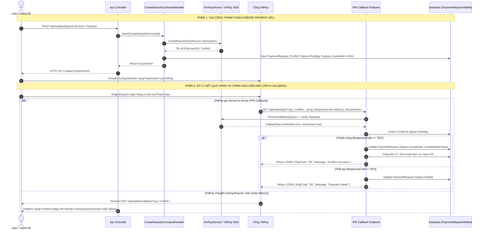

# BẢN THIẾT KẾ & HƯỚNG DẪN BƯNG HỆ THỐNG THANH TOÁN VNPAY (VNPAY PAYMENT ARCHITECTURE BLUEPRINT)

Tài liệu này hướng dẫn chi tiết cách bưng (port) toàn bộ kiến trúc **Thanh toán trực tuyến VNPay & Ví điện tử nội bộ** từ dự án **`Kickify_BE`** sang bất kỳ dự án Backend `.NET 8` nào.

---

## 🎯 1. TỔNG QUAN KIẾN TRÚC THANH TOÁN KICKIFY

Hệ thống thanh toán Kickify giải quyết 2 bài toán chính:
1. **Nạp tiền vào Ví điện tử (Wallet Deposit)**: Người dùng nạp tiền qua VNPay để tích lũy số dư ví.
2. **Thanh toán trực tiếp qua VNPay (Direct Payment / Check-In / VIP)**: Người dùng thanh toán dịch vụ trực tiếp bằng VNPay không qua số dư ví (có tích hợp tự động hoàn tiền vào Ví nếu xử lý dịch vụ bị lỗi).

---

## 🔄 2. SƠ ĐỒ TRÌNH TỰ THANH TOÁN VNPAY (SEQUENCE DIAGRAM)

Quy trình thanh toán chuẩn VNPay với cơ chế **IPN (Server-to-Server)** và **Redirect (Browser Return)**:



---

## 🗄️ 3. CHI TIẾT TỪNG TẦNG (LAYER-BY-LAYER CODE BLUEPRINT)

### 3.1. Tầng Domain Layer (`YourProject.Domain`)

#### ① Enum Trạng thái Thanh toán (`PaymentStatus.cs`)
```csharp
namespace YourProject.Domain.Enums;

public enum PaymentStatus
{
    Pending = 0,    // Đang chờ thanh toán
    Completed = 1,  // Thanh toán thành công
    Failed = 2,     // Thanh toán thất bại
    Expired = 3,    // Hết hạn 15 phút không thanh toán
    Refunded = 4    // Đã hoàn tiền
}
```

#### ② Enum Mục đích Thanh toán (`PaymentPurpose.cs`)
```csharp
namespace YourProject.Domain.Enums;

public enum PaymentPurpose
{
    WalletDeposit = 0,      // Nạp tiền ví
    ServiceBooking = 1,     // Đặt lịch/Dịch vụ trực tiếp
    PremiumPurchase = 2     // Mua gói VIP/Premium
}
```

#### ③ Entity `PaymentRequest.cs`
Bảng lưu lịch sử giao dịch và đối soát VNPay:

```csharp
using YourProject.Domain.Common;
using YourProject.Domain.Enums;

namespace YourProject.Domain.Entities;

public class PaymentRequest : BaseEntity
{
    public Guid PaymentRequestId { get; set; }
    public string TxnRef { get; set; } = string.Empty; // Mã giao dịch duy nhất gửi VNPay
    public Guid UserId { get; set; }
    public Guid WalletId { get; set; }
    public decimal Amount { get; set; }
    public PaymentStatus Status { get; set; } = PaymentStatus.Pending;
    public PaymentPurpose Purpose { get; set; } = PaymentPurpose.WalletDeposit;
    
    public Guid? TargetId { get; set; } // ID đối tượng thanh toán (VD: BookingId, ServiceId)
    public string? VnpayTransactionNo { get; set; } // Mã giao dịch của VNPay trả về
    public DateTime ExpiredAt { get; set; }
    public DateTime? CompletedAt { get; set; }
}
```

---

### 3.2. Tầng Application Layer (`YourProject.Application`)

#### ① Interface VNPay Service (`IVnPayService.cs`)
```csharp
using Microsoft.AspNetCore.Http;
using YourProject.Application.DTOs;

namespace YourProject.Application.Abstractions.Services;

public interface IVnPayService
{
    (string Url, string TxnRef) CreatePaymentUrl(decimal amount, string description);
    VnPayCallbackData? ProcessCallback(IQueryCollection query);
}

public class VnPayCallbackData
{
    public string TxnRef { get; set; } = string.Empty;
    public decimal Amount { get; set; }
    public string ResponseCode { get; set; } = string.Empty;
    public string TransactionStatus { get; set; } = string.Empty;
    public string TransactionNo { get; set; } = string.Empty;
    public string BankCode { get; set; } = string.Empty;
    public long VnpayTransactionId { get; set; }
    public bool IsVerified { get; set; }
    public bool IsSuccess => ResponseCode == "00" && TransactionStatus == "00";
}
```

#### ② Command Tạo URL Thanh toán (`CreateDepositCommandHandler.cs`)
```csharp
public async Task<Result<CreateDepositCommandResponse>> Handle(
    CreateDepositCommand request,
    CancellationToken cancellationToken)
{
    var user = await _userRepository.GetByIdAsync(_userContext.UserId);
    var wallet = await _walletRepository.GetByUserIdAsync(user.UserId, cancellationToken);

    // 1. Gọi VNPay Service sinh Payment URL
    var (paymentUrl, txnRef) = _vnPayService.CreatePaymentUrl(
        request.Amount,
        "Nap tien vi thanh toan"
    );

    // 2. Lưu PaymentRequest với trạng thái Pending (hạn 15 phút)
    var expiredAt = DateTime.UtcNow.AddMinutes(15);
    var paymentRequest = new PaymentRequest
    {
        PaymentRequestId = Guid.NewGuid(),
        TxnRef = txnRef,
        UserId = user.UserId,
        WalletId = wallet.WalletId,
        Amount = request.Amount,
        Status = PaymentStatus.Pending,
        Purpose = PaymentPurpose.WalletDeposit,
        CreatedAt = DateTime.UtcNow,
        ExpiredAt = expiredAt
    };

    await _paymentRequestRepository.AddAsync(paymentRequest);
    await _unitOfWork.SaveChangesAsync(cancellationToken);

    return Result.Success(new CreateDepositCommandResponse
    {
        PaymentUrl = paymentUrl,
        TxnRef = txnRef,
        Amount = request.Amount,
        ExpiredAt = expiredAt
    });
}
```

#### ③ Command Xử lý IPN Callback (`ProcessDepositIpnCommandHandler.cs`)
Tầng xử lý an toàn chống Idempotency (xử lý trùng 2 lần):

```csharp
public async Task<Result<ProcessDepositIpnCommandResponse>> Handle(
    ProcessDepositIpnCommand request,
    CancellationToken cancellationToken)
{
    var callback = request.CallbackData;

    // 1. Kiểm tra đơn hàng có tồn tại trong DB không
    var paymentRequest = await _paymentRequestRepository.GetByTxnRefAsync(callback.TxnRef, cancellationToken);
    if (paymentRequest == null)
    {
        return Result.Success(new ProcessDepositIpnCommandResponse { Success = false, RspCode = "01", Message = "Order not found" });
    }

    // 2. Kiểm tra Idempotency: Nếu đơn đã xử lý rồi -> Trả về thành công luôn cho VNPay
    if (paymentRequest.Status != PaymentStatus.Pending)
    {
        return Result.Success(new ProcessDepositIpnCommandResponse { Success = true, RspCode = "00", Message = "Order already confirmed" });
    }

    // 3. Kiểm tra số tiền có khớp không
    if (paymentRequest.Amount != callback.Amount)
    {
        return Result.Success(new ProcessDepositIpnCommandResponse { Success = false, RspCode = "04", Message = "Invalid amount" });
    }

    // 4. Nếu VNPay báo giao dịch thất bại
    if (!callback.IsSuccess)
    {
        paymentRequest.Status = PaymentStatus.Failed;
        _paymentRequestRepository.Update(paymentRequest);
        await _unitOfWork.SaveChangesAsync(cancellationToken);
        return Result.Success(new ProcessDepositIpnCommandResponse { Success = false, RspCode = "00", Message = "Payment failed" });
    }

    // 5. Nếu VNPay báo giao dịch THÀNH CÔNG -> Đánh dấu Completed trước
    paymentRequest.Status = PaymentStatus.Completed;
    paymentRequest.VnpayTransactionNo = callback.VnpayTransactionId.ToString();
    paymentRequest.CompletedAt = DateTime.UtcNow;
    _paymentRequestRepository.Update(paymentRequest);

    // 6. Phân nhánh xử lý theo Mục đích thanh toán (Purpose)
    if (paymentRequest.Purpose == PaymentPurpose.WalletDeposit)
    {
        var wallet = await _walletRepository.GetByIdAsync(paymentRequest.WalletId);
        wallet.Balance += paymentRequest.Amount;
        _walletRepository.Update(wallet);

        await _walletTransactionRepository.AddAsync(new WalletTransaction
        {
            TransactionId = Guid.NewGuid(),
            WalletId = wallet.WalletId,
            TransactionType = TransactionType.Deposit,
            Amount = paymentRequest.Amount,
            BalanceAfter = wallet.Balance,
            TransactionCode = callback.VnpayTransactionId.ToString(),
            ReferenceId = paymentRequest.PaymentRequestId,
            Description = $"Deposit by VNPay - {callback.BankCode}",
            CreatedAt = DateTime.UtcNow
        });
    }

    await _unitOfWork.SaveChangesAsync(cancellationToken);

    return Result.Success(new ProcessDepositIpnCommandResponse { Success = true, RspCode = "00", Message = "Confirm Success" });
}
```

---

### 3.3. Tầng Infrastructure Layer (`YourProject.Infrastructure`)

#### ① Implementation VNPay Service (`VnPayService.cs`)
Sử dụng thư viện `VNPAY.Extensions`:

```csharp
using Microsoft.AspNetCore.Http;
using VNPAY;
using VNPAY.Models;
using VNPAY.Models.Enums;
using YourProject.Application.Abstractions.Services;
using YourProject.Application.DTOs;

namespace YourProject.Infrastructure.Payment;

public class VnPayService : IVnPayService
{
    private readonly IVnpayClient _vnpayClient;

    public VnPayService(IVnpayClient vnpayClient)
    {
        _vnpayClient = vnpayClient;
    }

    public (string Url, string TxnRef) CreatePaymentUrl(decimal amount, string description)
    {
        var request = new VnpayPaymentRequest
        {
            Money = (double)amount,
            Description = description,
            BankCode = BankCode.ANY,
            Language = DisplayLanguage.Vietnamese
        };

        var paymentUrlInfo = _vnpayClient.CreatePaymentUrl(request);
        var txnRef = request.PaymentId.ToString();

        return (paymentUrlInfo.Url, txnRef);
    }

    public VnPayCallbackData? ProcessCallback(IQueryCollection query)
    {
        try
        {
            var txnRef = query["vnp_TxnRef"].ToString();
            var vnpAmount = query["vnp_Amount"].ToString();
            var vnpResponseCode = query["vnp_ResponseCode"].ToString();
            var vnpTransactionNo = query["vnp_TransactionNo"].ToString();
            var vnpBankCode = query["vnp_BankCode"].ToString();
            var vnpTransactionStatus = query["vnp_TransactionStatus"].ToString();

            if (string.IsNullOrEmpty(txnRef) || string.IsNullOrEmpty(vnpResponseCode))
                return null;

            decimal amount = 0;
            if (long.TryParse(vnpAmount, out var rawAmount))
                amount = rawAmount / 100m; // VNPay nhân 100 số tiền

            long.TryParse(vnpTransactionNo, out var transactionId);

            return new VnPayCallbackData
            {
                TxnRef = txnRef,
                Amount = amount,
                ResponseCode = vnpResponseCode,
                TransactionStatus = string.IsNullOrEmpty(vnpTransactionStatus) ? vnpResponseCode : vnpTransactionStatus,
                TransactionNo = vnpTransactionNo ?? "",
                BankCode = vnpBankCode ?? "",
                VnpayTransactionId = transactionId,
                IsVerified = true
            };
        }
        catch
        {
            return null;
        }
    }
}
```

#### ② Đăng ký Dependency Injection (`DependencyInjection.cs`)

```csharp
using VNPAY.Extensions;

private static IServiceCollection AddVNPay(this IServiceCollection services, IConfiguration configuration)
{
    var vnpayConfig = configuration.GetSection("VNPAY");
    services.AddVnpayClient(config =>
    {
        config.TmnCode = vnpayConfig["TmnCode"]!;
        config.HashSecret = vnpayConfig["HashSecret"]!;
        config.BaseUrl = vnpayConfig["BaseUrl"]!;
        config.CallbackUrl = vnpayConfig["CallbackUrl"]!;
        config.Version = vnpayConfig["Version"]!;
        config.OrderType = vnpayConfig["OrderType"]!;
    });

    services.AddScoped<IVnPayService, VnPayService>();
    return services;
}
```

---

### 3.4. Tầng Presentation Layer (`YourProject.Api`)

#### Endpoints Controller (`WalletsController.cs`)

```csharp
[ApiController]
[Route("api/wallets")]
public class WalletsController : ControllerBase
{
    private readonly IMediator _mediator;
    private readonly IVnPayService _vnPayService;

    // 1. API Nạp tiền -> Trả về VNPay Payment URL
    [HttpPost("deposit")]
    [Authorize]
    public async Task<IResult> CreateDeposit([FromBody] CreateDepositCommand command, CancellationToken cancellationToken)
    {
        var result = await _mediator.Send(command, cancellationToken);
        return result.MatchCreated(d => $"/api/wallets/transactions");
    }

    // 2. IPN Callback (Server-to-Server từ VNPay gọi sang)
    [HttpGet("ipn")]
    public async Task<IActionResult> IpnCallback(CancellationToken cancellationToken)
    {
        try
        {
            var callbackData = _vnPayService.ProcessCallback(Request.Query);
            if (callbackData == null)
            {
                return Ok(new { RspCode = "97", Message = "Invalid data" });
            }

            var command = new ProcessDepositIpnCommand { CallbackData = callbackData };
            var result = await _mediator.Send(command, cancellationToken);

            return Ok(new
            {
                RspCode = result.Value?.RspCode ?? "99",
                Message = result.Value?.Message ?? "Unknown error"
            });
        }
        catch
        {
            return Ok(new { RspCode = "99", Message = "Server error" });
        }
    }

    // 3. Browser Return Callback (User chuyển hướng về sau khi thanh toán)
    [HttpGet("callback")]
    public IActionResult PaymentCallback()
    {
        var callbackData = _vnPayService.ProcessCallback(Request.Query);

        var redirectUrl = callbackData.IsSuccess
            ? $"https://your-frontend-domain.com/payment/success?txnRef={callbackData.TxnRef}&amount={callbackData.Amount}"
            : $"https://your-frontend-domain.com/payment/failure?code={callbackData.ResponseCode}";

        return Redirect(redirectUrl);
    }
}
```

---

## ⚙️ 4. CẤU HÌNH `appsettings.json`

Cấu hình tài khoản Sandbox VNPay thử nghiệm:

```json
{
  "VNPAY": {
    "TmnCode": "YOUR_SANDBOX_TMN_CODE",
    "HashSecret": "YOUR_SANDBOX_HASH_SECRET",
    "BaseUrl": "https://sandbox.vnpayment.vn/paymentv2/vpcpay.html",
    "CallbackUrl": "https://your-backend-api-domain.com/api/wallets/callback",
    "Version": "2.1.0",
    "OrderType": "other"
  }
}
```

---

## 📦 5. NUGET PACKAGES CẦN CÀI CHO DỰ ÁN MỚI

Thêm gói thư viện `VNPAY.Extensions` vào tầng **Infrastructure**:

```bash
dotnet add YourProject.Infrastructure package VNPAY.Extensions
```

---

## ✅ 6. CHECKLIST 7 BƯỚC BƯNG THANH TOÁN SANG DỰ ÁN MỚI

```
□ 1. [NuGet]          Thêm package VNPAY.Extensions vào Infrastructure.csproj.
□ 2. [appsettings]    Thêm khối cấu hình "VNPAY" (TmnCode, HashSecret, BaseUrl, CallbackUrl).
□ 3. [Domain]         Tạo Entity PaymentRequest, Enum PaymentStatus và PaymentPurpose.
□ 4. [Infrastructure] Copy VnPayService.cs và đăng ký services.AddVnpayClient() + AddScoped<IVnPayService>().
□ 5. [Application]    Tạo CreateDepositCommand (sinh PaymentUrl) & ProcessDepositIpnCommand (xử lý IPN callback).
□ 6. [Api Controller] Tạo 3 endpoints: POST /deposit, GET /ipn (Server-to-Server), GET /callback (Redirect Frontend).
□ 7. [Security]       Kiểm tra tính Idempotency: Kiểm tra Status != Pending trước khi xử lý IPN để tránh xử lý trùng.
```

---

*Tài liệu này được trích xuất và chuẩn hóa từ hệ thống thanh toán thực tế của Kickify_BE.*
